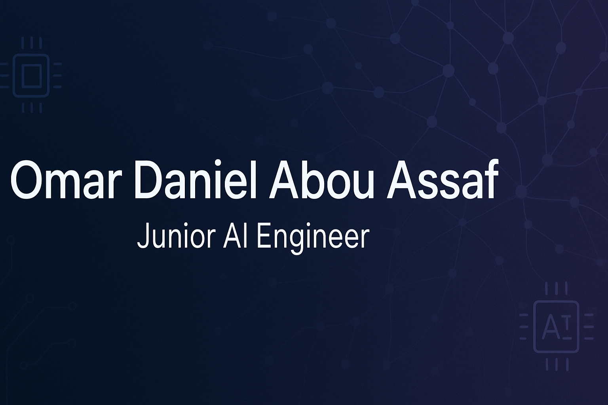

# Hi there! 👋 I'm Omar Daniel Abou Assaf

## 🚀 About Me

I'm a passionate **Junior AI Engineer** with a strong foundation in machine learning, deep learning, and natural language processing. My academic background in Informatics Engineering with a specialization in Artificial Intelligence, coupled with hands-on project experience, has equipped me with the skills to design, build, and deploy robust AI models.

- 🎓 **Education**: B.S. in Informatics Engineering (AI Specialization) from Arab International University
- 💼 **Current Role**: Private AI & Programming Tutor
- 🌍 **Location**: Venezuela, Carabobo
- 📧 **Contact**: omarabouassaf098@gmail.com
- 📱 **Phone**: +58 4144279609
- 🔗 **Kaggle**: [daniel09817](https://www.kaggle.com/daniel09817)

## 💻 Technical Skills

### Programming Languages

### AI/ML Frameworks & Libraries

### Data Science & Analysis

### Tools & Technologies

## 🎯 Areas of Expertise

- **🧠 Deep Learning**: CNN, RNN, Transfer Learning, Neural Networks
- **👁️ Computer Vision**: Image Classification, Object Detection, Medical Imaging
- **📝 Natural Language Processing**: BERT, Transformers, Sentiment Analysis
- **🏥 Medical AI**: fMRI Analysis, Neuroimaging, Brain Connectivity
- **📊 Data Analysis**: Statistical Modeling, Data Visualization, Predictive Analytics
- **☁️ Cloud Computing**: Model Deployment, Scalable AI Solutions

## 🏆 Featured Projects

### 🧠 Autism Spectrum Disorder Detection using fMRI
**Accuracy: 96%** | [View Repository](#)

Built a CNN model to classify Autism Spectrum Disorder using fMRI data from the ABIDE dataset. This project demonstrates advanced skills in medical AI and neuroimaging data processing.

**Key Technologies**: Python, Nilearn, TensorFlow, CNN, ABIDE dataset, AAL atlas

**Highlights**:
- Preprocessed neuroimaging data with Nilearn and C-PAC
- Extracted BOLD signals using AAL atlas
- Computed wavelet coherence to generate input matrices
- Achieved 96% classification accuracy

---

### 😷 Face Mask Detection Using CNN and Transfer Learning
**Accuracy: 99%** | [View Repository](#)

Developed an AI-based face mask detection system using transfer learning with VGG16 and ResNet50 models for real-time detection applications.

**Key Technologies**: TensorFlow, Keras, VGG16, ResNet50, OpenCV

**Highlights**:
- Implemented transfer learning with pre-trained models
- Achieved 99% validation accuracy
- Real-time detection capabilities
- Robust computer vision application

---

### 💭 Sentiment Analysis with Transformers
**Accuracy: 96%** | [View Repository](#)

Fine-tuned a pre-trained BERT model for sentiment analysis using the Tweet Sentiment Extraction dataset, showcasing expertise in NLP and transformer models.

**Key Technologies**: Hugging Face Transformers, BERT, PyTorch

**Highlights**:
- Applied advanced tokenization and attention mechanisms
- Implemented class balancing techniques
- Fine-tuned state-of-the-art transformer model
- Achieved 96% accuracy on sentiment classification

---

### 🔍 Deepfake Image Detection with CNN
**Accuracy: 98%** | [View Repository](#)

Created a robust CNN model to detect real vs. manipulated images, addressing the growing concern of deepfake content in digital media.

**Key Technologies**: Keras, TensorFlow, CNN, Image Data Generator

**Highlights**:
- Implemented data augmentation and regularization
- Achieved over 98% accuracy in detection
- Robust against various manipulation techniques
- Practical application for media verification

## 📈 GitHub Statistics

  
  

  

## 🎓 Education & Certifications

### 🏫 Academic Background
- **Bachelor of Science in Informatics Engineering** (2019-2024)
  - Major: Artificial Intelligence
  - Institution: Arab International University, Syria

### 📜 Professional Certifications
- **Data Analysis and Visualization Foundations** - IBM (Coursera)
- **Intermediate Deep Learning with PyTorch** - DataCamp
- **Deep Learning for Text with PyTorch** - DataCamp
- **Understanding Cloud Computing** - DataCamp
- **Create Machine Learning Models in Microsoft Azure** - Microsoft (Coursera)

## 💼 Professional Experience

### 👨‍🏫 Private AI & Programming Tutor
**Self-Employed** | Feb 2023 – Present | Remote

- Designed and delivered custom lessons on Python, machine learning, and AI fundamentals to beginners and university students
- Taught foundational topics including data structures, algorithms, NumPy, Pandas, and model evaluation
- Helped students build end-to-end projects, including sentiment analysis and image classification
- Developed curriculum for AI education and mentored aspiring data scientists

## 🌟 What I'm Currently Working On

- 🔬 Exploring advanced transformer architectures for multilingual NLP
- 🏥 Developing AI solutions for medical image analysis
- 📚 Contributing to open-source AI projects
- 🎯 Building production-ready ML pipelines

## 🤝 Let's Connect!

I'm always interested in discussing new opportunities, collaborations, or just connecting with fellow AI enthusiasts. Feel free to reach out!

---

  

  <i>⭐️ From <a href="https://github.com/omar0998">omar0998</a> - Building the future with AI, one model at a time! 🚀</i>

